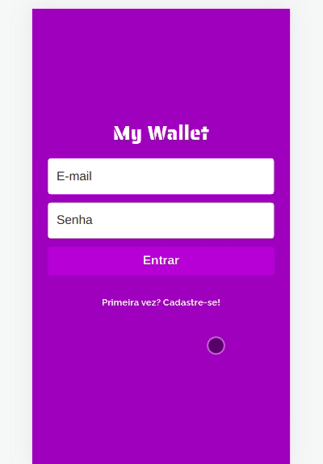

# My Wallet

A Front-end project written in React that allows you to manage your expenses and revenues.



Try it out now at https://mywallet-frontend.vercel.app

## About

This is an web application with which lots of people can manage their own expenses and revenues. Below are the implemented features:

- Sign Up
- Login
- List all financial events for a user
- Add and remove expense
- Add and remove revenue

## Technologies

The following tools and frameworks were used in the construction of the project:<br>
<p>
  
  
  
  
  
</p>

## How to run

1. Clone this repository
2. Clone the back-end repository at https://github.com/lfaires/MyWallet-Back
3. Follow instructions to run back-end at https://github.com/lfaires/MyWallet-Back
4. Install dependencies
```bash
npm i
```
5. Run the front-end with
```bash
npm start
```
6. You can optionally build the project running
```bash
npm run build
```
7. Access http://localhost:3000 on your favorite browser